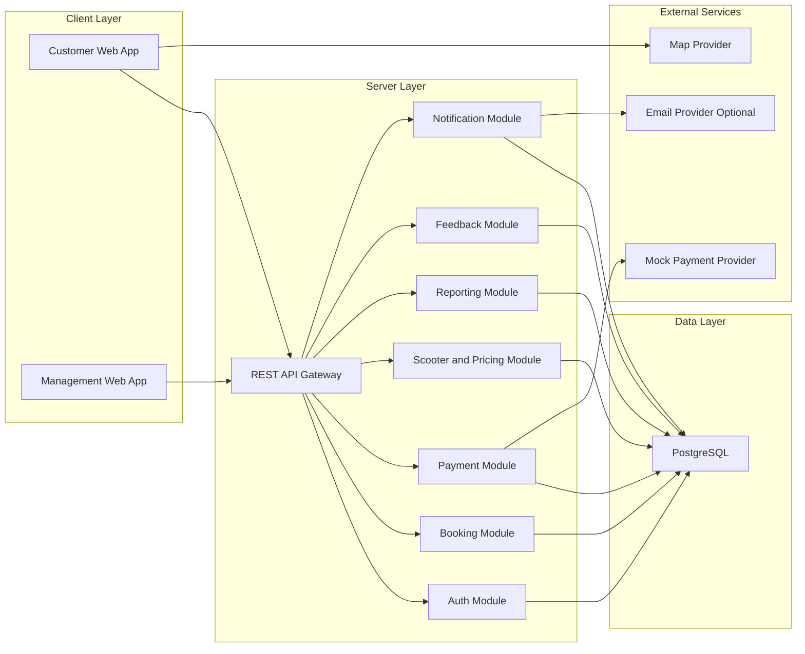
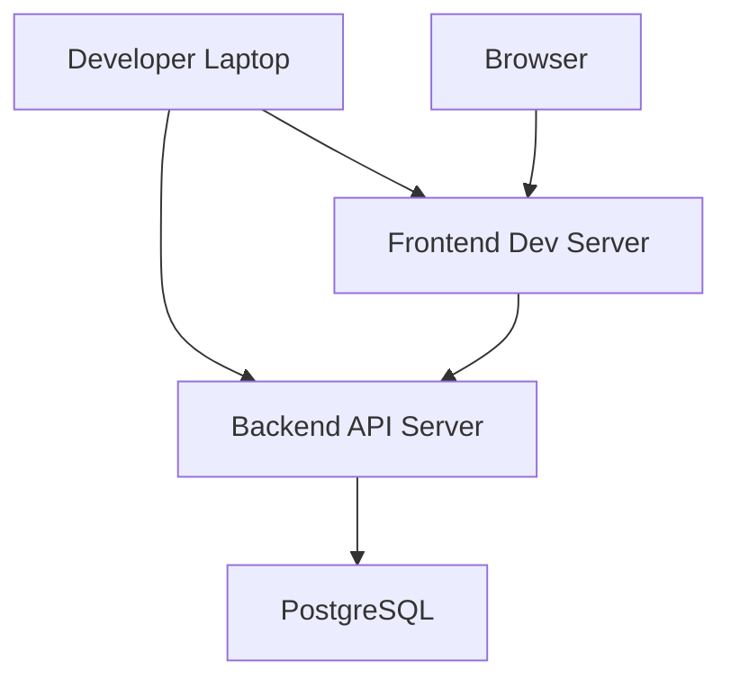

# 电动滑板车租赁系统架构图草案（B/S 架构）

> 目标：满足你们“采用 B/S 架构、避免过于简化技术栈”的前置要求。  
> 本文用于 `Initial Design` 与后续 `Sprint` 迭代说明。

## 1. 架构决策

- 架构模式：`B/S`（Browser/Server），客户端为浏览器访问。
- 运行方式：本地可运行（满足课程要求），后续可选容器化。
- 技术栈建议（示例）：
  - 前端：`React + TypeScript + Vite`
  - 后端：`NestJS`（或 `Spring Boot` / `Django REST`）
  - 数据库：`PostgreSQL`（开发初期可用 SQLite 做临时验证）
  - 地图：`Leaflet + OpenStreetMap`
  - 自动化：`GitHub Actions`（lint/test/build）

说明：课程没有强制某一套技术，但你们要保证“功能可实现 + 团队能掌握 + 可测试可演示”。

## 2. 系统容器图（Container View）

## 3. 关键模块职责（后续拆 Issue 的依据）

- `Auth Module`
  - 用户注册、登录、角色权限（客户/管理员）
  - 对应 backlog：ID `1`
- `Scooter & Pricing Module`
  - 车辆状态、位置、租赁时长与价格配置
  - 对应 backlog：ID `4`、`16`、`17`、`18`
- `Booking Module`
  - 创建/取消/延长订单、订单状态流转
  - 对应 backlog：ID `5`、`11`、`12`
- `Payment Module`
  - 模拟支付、支付记录
  - 对应 backlog：ID `6`
- `Notification Module`
  - 生成并展示确认信息，可选邮件通知
  - 对应 backlog：ID `7`、`8`
- `Reporting Module`
  - 周收入与日收入统计、图形化
  - 对应 backlog：ID `19`、`20`、`21`
- `Feedback Module`
  - 故障反馈、优先级与处理
  - 对应 backlog：ID `13`、`14`、`15`

## 4. 部署与运行视图（本地演示优先）

## 5. 非功能需求落地

- 并发支持（ID 23）
  - 后端接口保持无状态，数据库事务保证一致性。
  - 对“同一车辆并发预订”做冲突校验。
- 响应式与可访问性（ID 24, 25）
  - 前端使用响应式布局；字体和颜色对比满足可读性。
- 测试策略
  - 单元测试：核心服务（价格计算、折扣规则、状态流转）。
  - 接口测试：预订、支付、取消、统计。
  - UI 流程测试：核心用户路径（登录->预订->支付->查看记录）。

## 6. Sprint 1 最小落地边界

- 前端
  - 登录/注册页面
  - 车辆列表+价格展示
  - 创建预订与支付确认页面
  - 预订记录页面
- 后端
  - Auth API
  - Booking API
  - Payment API（模拟）
  - Scooter/Pricing 查询 API
- 数据库
  - users、scooters、bookings、payments、pricing_rules（最小 5 张表）

## 7. 架构类 Issues（示例）

1. `design: define API contracts for auth/booking/payment`
2. `design: create ERD for sprint1 core tables`
3. `backend: setup project skeleton and modules`
4. `frontend: setup routing and page scaffolding`
5. `test: add CI workflow for lint and unit tests`
