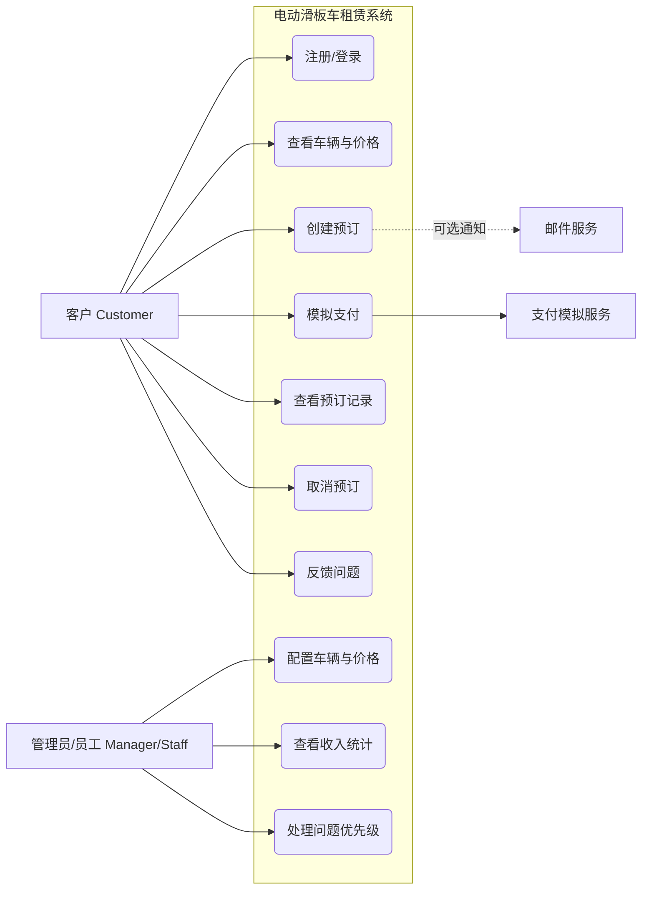
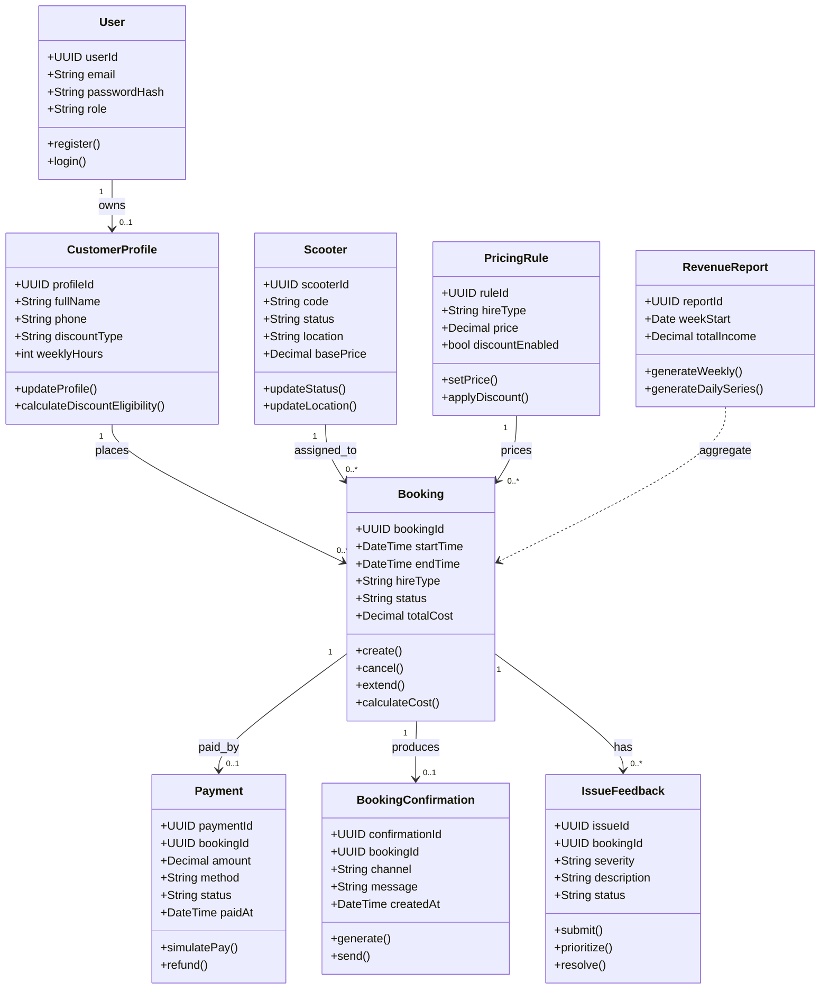
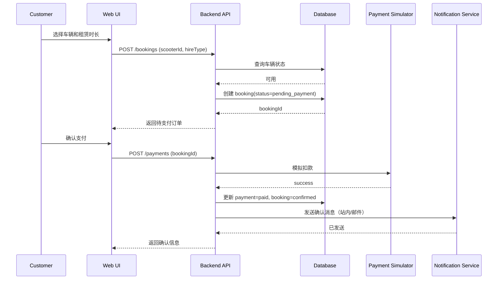
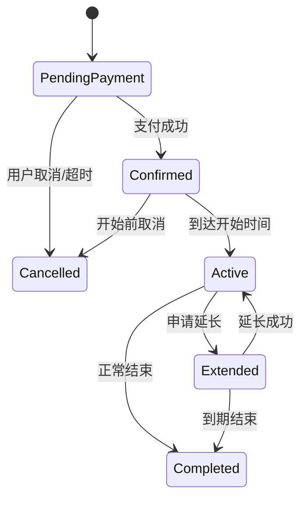

# 电动滑板车租赁系统 UML 图草案（Sprint 1 版本）

> 说明：这份文档用于 `Initial Design` 页面，强调“需求分析和结构设计”，不是最终代码实现。  
> 设计范围：优先覆盖高优先级功能（账号、预订、支付、取消、记录、管理配置、收入统计）。

## 1. 用例图（Use Case，采用 Mermaid 流程图表达）

## 2. 领域类图（Domain Class Diagram）

## 3. 核心时序图（创建预订并支付）

## 4. 预订状态图（便于后端实现状态机）

## 5. 与 backlog 的对应关系（Sprint 1 重点）

- `UC1 + User/CustomerProfile` 对应 ID `1`
- `UC2 + Scooter/PricingRule` 对应 ID `4`
- `UC3 + Booking` 对应 ID `5`
- `UC4 + Payment` 对应 ID `6`
- `UC5 + BookingConfirmation` 对应 ID `8`
- `UC6 + Booking.status` 对应 ID `12`
- `UC7 + PricingRule/Scooter` 对应 ID `16`
- `UC8 + RevenueReport` 对应 ID `19`

## 6. Sprint 1 的 UML 使用建议

- 先把上述图放进 Wiki 的 `Initial Design` 页面。
- 组会讨论后，只改“名称和边界”，不要一开始追求特别复杂。
- 如果实现时有变化，在 `Sprint 1 Outcomes` 里补充“设计变更说明”。

